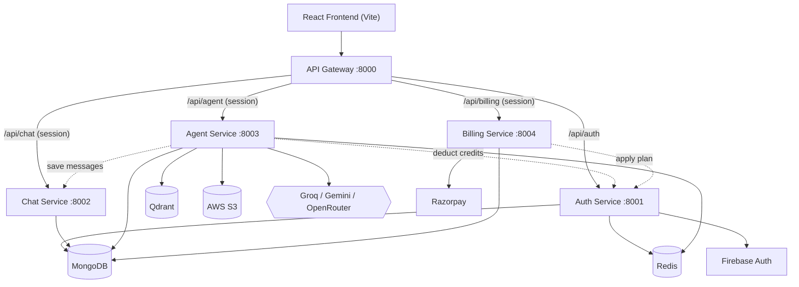
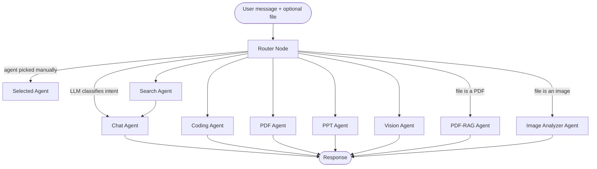

# CortexAI

A ChatGPT-style AI assistant I built from scratch, split into microservices instead of one big backend. A LangGraph router sends every message to whichever of 8 specialized agents fits best — chat, web search, coding, PDF/PPT generation, RAG over uploaded PDFs, image generation, and image analysis — and the whole thing has real auth, billing, and rate limiting behind it, not just a demo wrapper around an API call.

## What it does

- Chat with memory — conversations are cached in Redis so context carries across turns
- Web search through Tavily, with image results pulled in alongside the text
- A coding agent that first classifies what you're actually asking for (new project vs. review vs. debug vs. optimize), and for project generation returns a full multi-file app rendered live in an embedded Monaco editor with a sandboxed preview — basically my own version of an "Artifacts" panel
- PDF and PPT generation on demand (PDFKit / PptxGenJS)
- RAG over uploaded PDFs — chunks the text, embeds it, stores it in Qdrant, and only answers from what it actually retrieves
- Text-to-image generation (it rewrites your prompt into something more detailed before generating)
- Image analysis — OCR, explaining charts/tables, general Q&A over an uploaded image
- Firebase auth backed by server-side sessions in Redis, not just a JWT floating in a cookie
- Credit-based billing through Razorpay, with signatures verified server-side
- Per-user, per-agent rate limiting so one agent getting hammered doesn't blow through the API budget for everyone
- Voice input on the frontend, Docker + GitHub Actions shipping to AWS

## Architecture

Five services behind one gateway:



The gateway is the only thing that touches the session cookie. It looks the session up in Redis and forwards the user ID to whatever service it's proxying to as an `x-user-id` header, so the other services just trust the header instead of re-verifying auth on every request.

## How the routing works

The agent service compiles a `StateGraph` — a router node, then 8 leaf agents:



The logic, in order: if you picked an agent manually, that wins. Otherwise, a file upload routes itself — PDFs to the RAG agent, images to the analyzer. Otherwise an LLM call reads the message and classifies it into chat / search / coding / pdf / ppt / vision. Search never returns straight to the user either — it always hands its results to the chat agent first, so you get an actual synthesized answer instead of a dump of search results.

Model routing per task:

| Task | Provider | Model |
|---|---|---|
| Chat, search synthesis, routing, intent classification, PDF/PPT content, image-prompt writing | Groq | `openai/gpt-oss-120b` |
| Code generation | OpenRouter | `deepseek/deepseek-chat` |
| Image analysis | Google Gemini | `gemini-2.5-flash` |
| Embeddings for RAG | Google Gemini | `gemini-embedding-001` |

## Tech stack

| Layer | Technologies |
|---|---|
| Frontend | React 19, Redux Toolkit, Vite, Tailwind CSS 4, Monaco Editor, react-markdown, react-syntax-highlighter, Framer Motion, Firebase client SDK |
| Gateway | Express 5, express-http-proxy |
| Auth | Firebase Admin SDK, MongoDB, Redis |
| Chat | Express, MongoDB |
| Agent (AI core) | LangGraph, LangChain, Groq, Gemini, OpenRouter, Qdrant, Tavily, PDFKit, PptxGenJS, AWS SDK |
| Billing | Razorpay, MongoDB |
| Infra | Docker, Docker Compose, GitHub Actions, AWS ECS/ECR/S3/CloudFront |

## Project structure

```
1.cortexAI/
├── backend/
│   ├── gateway/                  # routing, session middleware, CORS
│   ├── services/
│   │   ├── auth/                 # firebase auth, sessions, credits, plans
│   │   ├── chat/                 # conversations & messages
│   │   ├── agent/                # the LangGraph multi-agent core
│   │   │   ├── agents/           # the 8 agent modules
│   │   │   ├── graph/            # state.js, router.js, graph.js
│   │   │   ├── config/           # LLMs, vector DB, embeddings, memory, rate limits
│   │   │   └── utils/            # S3, PDF/PPT generation, credit deduction
│   │   └── billing/               # razorpay orders & verification
│   └── shared/redis/
├── frontend/
│   ├── src/
│   │   ├── components/            # ChatArea, Artifact (Monaco + preview), Sidebar...
│   │   ├── features/              # API call thunks
│   │   ├── redux/
│   │   └── pages/
│   └── utils/                     # axios instance, firebase config
└── .github/workflows/deploy.yml
```

## Running it locally

You'll need Node 18+, a MongoDB instance, Redis (there's a `docker-compose.yml` for this), a Qdrant instance, an AWS S3 bucket, a Firebase project, a Razorpay account, and API keys for Groq, Google, OpenRouter, and Tavily.

```bash
git clone <your-repo-url>
cd 1.cortexAI

cd backend && npm install
cd gateway && npm install && cd ..
cd services/auth && npm install && cd ../..
cd services/chat && npm install && cd ../..
cd services/agent && npm install && cd ../..
cd services/billing && npm install && cd ../../..

cd frontend && npm install
```

Start Redis:
```bash
cd backend && docker compose up -d
```

Each service needs its own `.env`:

**gateway**
```env
PORT=8000
FRONTEND_URL=http://localhost:5173
AUTH_SERVICE=http://localhost:8001
CHAT_SERVICE=http://localhost:8002
AGENT_SERVICE=http://localhost:8003
BILLING_SERVICE=http://localhost:8004
```

**auth** (also needs a Firebase Admin service account JSON at `serviceAccountKey.json`, gitignored)
```env
PORT=8001
MONGODB_URI=your_mongodb_uri
REDIS_URL=your_redis_url
```

**chat**
```env
PORT=8002
MONGODB_URI=your_mongodb_uri
```

**agent**
```env
PORT=8003
MONGODB_URI=your_mongodb_uri
REDIS_URL=your_redis_url
QDRANT_URL=your_qdrant_url
AWS_REGION=your_aws_region
AWS_ACCESS_KEY_ID=your_aws_access_key_id
AWS_SECRET_KEY=your_aws_secret_key
AWS_BUCKET_NAME=your_s3_bucket_name
GROQ_API_KEY=your_groq_api_key
GOOGLE_API_KEY=your_google_api_key
OPENROUTER_API_KEY=your_openrouter_api_key
TAVILY_API_KEY=your_tavily_api_key
AUTH_SERVICE=http://localhost:8001
CHAT_SERVICE=http://localhost:8002
```

**billing**
```env
PORT=8004
MONGODB_URI=your_mongodb_uri
RAZORPAY_KEY_ID=your_razorpay_key_id
RAZORPAY_KEY_SECRET=your_razorpay_key_secret
AUTH_SERVICE=http://localhost:8001
```

**frontend**
```env
VITE_SERVER_URL=http://localhost:8000
VITE_FIREBASE_API_KEY=your_firebase_web_api_key
VITE_RAZORPAY_KEY_ID=your_razorpay_key_id
```
Heads up — `frontend/utils/firebase.js` also has `authDomain`, `projectId`, `storageBucket`, etc. hardcoded rather than pulled from env. Swap those for your own project's values too, or auth will point at mine.

Then just run each service with `npm run dev`, and `npm run dev` in `frontend/` for the client.

## API routes

| Method | Route | Service | What it does |
|---|---|---|---|
| POST | `/api/auth/login` | auth | verifies the Firebase token, finds or creates the user, starts a session |
| GET | `/api/auth/logout` | auth | kills the session |
| POST | `/api/auth/update-plan` | auth | internal — applies a plan after a verified payment |
| POST | `/api/auth/deduct-credits` | auth | internal — deducts credits after an agent call |
| GET | `/api/chat/create-conversation` | chat | new conversation |
| GET | `/api/chat/get-conversations` | chat | list the user's conversations |
| POST | `/api/chat/update-conversation` | chat | rename a conversation |
| POST | `/api/chat/save-message` | chat | internal — persists a message |
| GET | `/api/chat/get-messages/:conversationId` | chat | conversation history |
| POST | `/api/agent/chat` | agent | the main endpoint — runs the LangGraph workflow, accepts an optional file upload |
| POST | `/api/billing/create` | billing | creates a Razorpay order |
| POST | `/api/billing/verify` | billing | verifies the payment signature and applies the plan |
| GET | `/api/me` | gateway | current user's session data |

## Rate limits & credits

Every agent call is rate-limited per user, per minute, and costs credits:

| Agent | Requests/min | Credits |
|---|---|---|
| Chat | 20 | 1 |
| Search | 5 | 5 |
| Coding | 5 | 10 |
| PDF | 5 | 10 |
| PPT | 5 | 10 |
| Vision / Image | 5 | 10 |

| Plan | Price | Credits |
|---|---|---|
| Free | ₹0 | 100 |
| Starter | ₹199 | 500 |
| Pro | ₹499 | 1,000 |

## Deployment

Push to `main` and GitHub Actions builds a Docker image for each backend service, pushes it to ECR, and forces a redeploy on the matching ECS service. The frontend isn't containerized at all — it's just a Vite build synced to S3 with a CloudFront cache invalidation.

## License

Not added yet. Add one before making this public.

---
Aditya Verma
